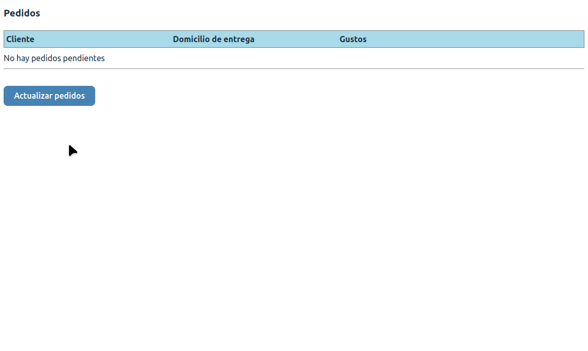
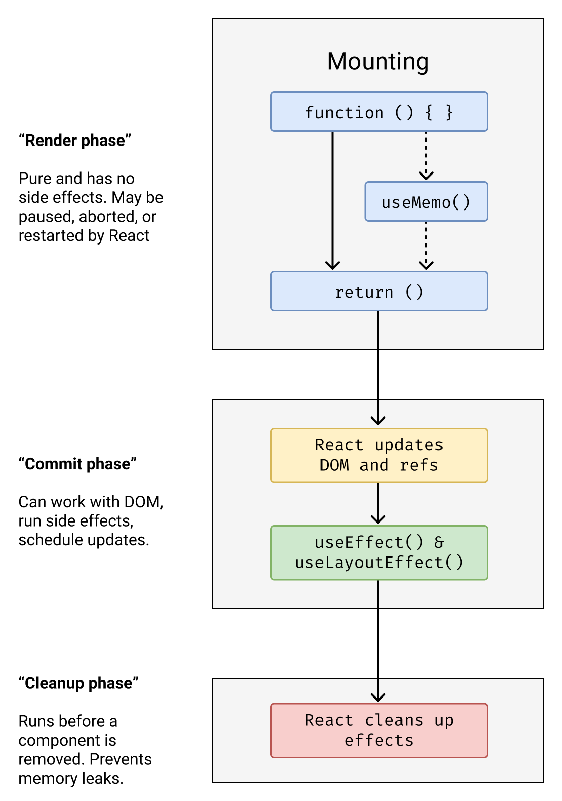

[](https://github.com/uqbar-project/eg-heladeria-react/actions/workflows/build.yml) 

## Ejemplo - Ciclo de vida de un componente React

La aplicación consiste en modelar los pedidos para una heladería:



Y en este ejemplo vamos a ver cómo invocar una función asincrónica, y su asociación con el ciclo de vida de los componentes de React.

## Arquitectura general de la aplicación


En esta solución participan

- el objeto de dominio Helado
- una función asincrónica que simula pedidos pendientes
- y el componente React que tiene un botón que los dispara

Dado que nuestro componente es una función, no podemos producir efectos colaterales (o "efectos"). De hecho si utilizáramos la variante con clases tampoco podemos hacerlo dentro de la función `render()` porque es cuando se están definiendo los elementos de nuestro DOM. 

## Dominio

El objeto de dominio que representa un helado almacena información sobre los gustos, dirección, etc., un identificador autogenerado internamente (utiliza una constante encapsulada dentro del archivo), y tiene métodos para

- informar que el pedido fue entregado
- informar que se canceló la entrega del pedido (vuelve a estar pendiente)
- determinar si el pedido está o no pendiente

## Servicio

La función `getPedidosPendientes` exportada es asincrónica, ya que la intención es simular que el origen de datos puede estar fuera de la VM donde se ejecuta la aplicación React. El objetivo que cumple cada vez que es invocada es:

- aleatoriamente marcar/desmarcar pedidos como entregados o pendientes, para forzar un cambio en la lista de pedidos pendientes de la heladería
- devolver la lista con los pedidos pendientes

## Componente React

### Estado

- Necesitamos que nuestro componente reaccione ante los cambios en los pedidos pendientes, por eso formará parte de nuestro estado.
- Además vamos a guardar un string que será un mensaje al usuario al actualizar satisfactoriamente los pedidos o bien un mensaje de error.

```jsx
const [pedidosPendientes, setPedidosPendientes] = useState<Pedido[]>([])
const [detail, setDetail] = useState<string>('')
```

### Render

El componente React toma los pedidos pendientes y los muestra en una tabla, delegando a otro componente hijo:

```jsx
return (
  <div className="main">
    <h3>Pedidos</h3>
    <div className="pedidos">
      <div className="header">
        <div>Cliente</div>
        <div>Domicilio de entrega</div>
        <div>Gustos</div>
      </div>
      {pedidosPendientes.map((pedido: Pedido, i: number) => {
        return <PedidoRow pedido={pedido} key={'pedido' + i}/>
      })}
    </div>
```

Un detalle importante es que cada elemento React debe tener una clave única que lo identifique, para poder asociarlo con el DOM que se visualiza en el navegador.

Además tenemos el toast implementado como un div que se muestra _condicionalmente_ si el estado `detail` tiene un valor:

```jsx
{detail && <div className="toast">{detail}</div>}
```

Dentro del render definimos una lambda que a los 10 segundos borra el mensaje del toast:

```ts
setTimeout(() => {
  setDetail('')
}, 10000)
```

> Pregunta para el lector: al hacer setDetail, ¿es necesario renderizar la lista de pedidos nuevamente o solamente se elimina el mensaje del toast?

### Eventos del componente



## Disparando la consulta

Para disparar la consulta tenemos un botón que llama a una función que **actualiza el estado**, generando así un nuevo render.

### Mostrando las diferencias

Un detalle adicional que queremos mostrar es

- cuántos pedidos nuevos hay (los que no estaban anteriormente y ahora aparecen = Nuevos - Viejos, según la teoría de conjuntos)
- cuántos pedidos se entregaron (los que estaban anteriormente y ahora no están = Viejos - Nuevos, según la teoría de conjuntos)

Aquí resolvemos la diferencia de conjuntos entre los nuevos y los viejos y viceversa (gracias a la función `differenceBy` de Lodash) y mostramos el toast en caso de que haya cambios.

## Test

El test del componente

- genera un stub del service, principalmente con fines didácticos, ya que no estamos realmente consultando a un servicio externo
- para testear que no hay pedidos, generamos un div vacío con un testid propio
- para testear que hay pedidos, buscamos cuántos elementos tienen el testid `row` (hay uno por cada pedido)

```js
beforeEach(() => {
  
  vi.mock('./service', () => ({ 
      getPedidosPendientes: () => Promise.resolve([
        new Pedido(['pistacchio', 'dulce de leche'], 'Francia 921 - San Martín', 'Luisa Arévalo'),
        new Pedido(['chocolate', 'crema tramontana', 'crema rusa'], 'Córdoba esq. Crámer', 'El Cholo'),
        new Pedido(['vainilla', 'limón', 'frutilla'], 'Murguiondo 1519', 'Camila Fusani'),
      ])
    })
  )
})

test('inicialmente no tenemos pedidos', () => {
  render(<PedidoComponent />)
  const emptyRow = screen.getByTestId('no-rows')
  expect(emptyRow).toBeTruthy()
})

test('cuando se actualiza el servidor aparecen nuevos pedidos', async () => {
  render(<PedidoComponent />)
  screen.getByTestId('actualizar').click()
  await waitFor(async () => {
    const allRows = screen.queryAllByTestId('row')
    expect(allRows.length).toBe(3)
  })
  
})
```

## Bibliografía adicional

- [Estado y ciclo de vida de los componentes de React](https://es.reactjs.org/docs/state-and-lifecycle.html)
