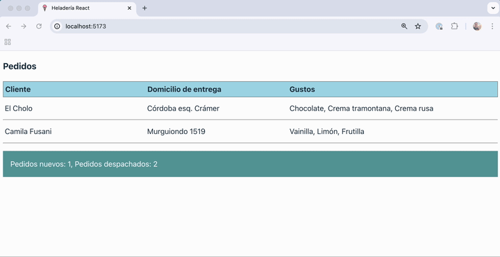
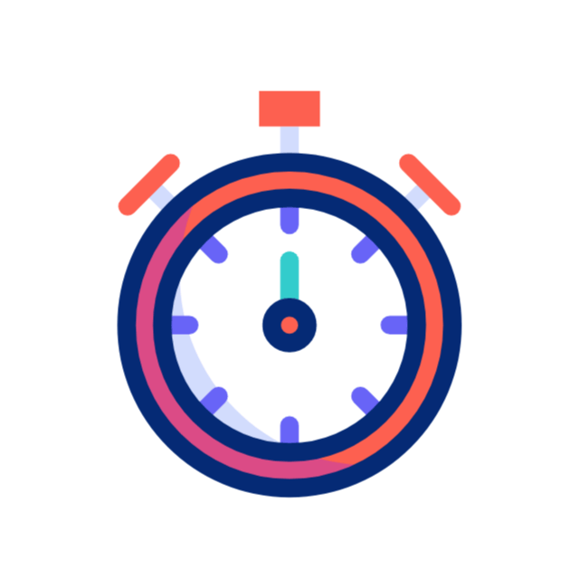
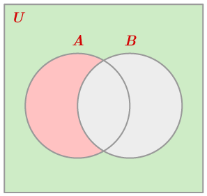

[](https://github.com/uqbar-project/eg-heladeria-react/actions/workflows/build.yml) [](https://codecov.io/gh/uqbar-project/eg-heladeria-react)

## Ejemplo - Ciclo de vida de un componente React

La aplicación consiste en modelar los pedidos para una heladería:



Y en este ejemplo vamos a ver cómo invocar una función asincrónica, y su asociación con el ciclo de vida de los componentes de React.

## Arquitectura general de la aplicación


En esta solución participan

- el objeto de dominio Helado
- una función asincrónica que simula pedidos pendientes
- y el componente React que a intervalos regulares dispara la consulta

Dado que nuestro componente es una función, no podemos producir efectos colaterales (o "efectos"). De hecho si utilizáramos la variante con clases tampoco podemos hacerlo dentro de la función `render()` porque es cuando se están definiendo los elementos de nuestro DOM. 

## Dominio

El objeto de dominio que representa un helado almacena información sobre los gustos, dirección, etc., un identificador autogenerado internamente (utiliza una constante encapsulada dentro del archivo), y tiene métodos para

- informar que el pedido fue entregado
- informar que se canceló la entrega del pedido (vuelve a estar pendiente)
- determinar si el pedido está o no pendiente

## Servicio

La función `getPedidosPendientes` exportada es asincrónica, ya que la intención es simular que el origen de datos puede estar fuera de la VM donde se ejecuta la aplicación React. El objetivo que cumple cada vez que es invocada es:

- aleatoriamente marcar/desmarcar pedidos como entregados o pendientes, para forzar un cambio en la lista de pedidos pendientes de la heladería
- devolver la lista con los pedidos pendientes

## Componente React

### Estado

- El componente necesita mantener los pedidos actuales como estado
- Para visualizar en un detalle la cantidad de pedidos nuevos y despachados utilizaremos una etiqueta especial (el detalle)


```tsx
const [pedidosPendientes, setPedidosPendientes] = useState<Pedido[]>([])
const [detail, setDetail] = useState<string>('')
```

### Render

El componente React toma los pedidos pendientes y los muestra en una tabla, delegando a otro componente hijo:

```jsx
return (
  <div className="main">
    <h3>Pedidos</h3>
    <div className="pedidos">
      <div className="header">
        <div>Cliente</div>
        <div>Domicilio de entrega</div>
        <div>Gustos</div>
      </div>
      {pedidosPendientes.map(pedido => <PedidoRow pedido={pedido} key={pedido.id} />)}
    </div>
```

Un detalle importante es que cada elemento React debe tener una clave única que lo identifique, para poder asociarlo con el DOM que se visualiza en el navegador.

Además tenemos el toast implementado como un div que se muestra _condicionalmente_ si el estado `detail` tiene un valor:

```tsx
{detail && <div className="toast">{detail}</div>}
```

### Disparando la consulta

Dentro del render definimos una lambda que busca los pedidos pendientes cada 5 segundos:

```ts
const intervalRef = useRef<number | null>(null)

...

// Disparar polling automáticamente solo la primera vez
if (!intervalRef.current) {
  intervalRef.current = setInterval(actualizarPedidos, 5000)
  actualizarPedidos()
}
```



### Mostrando las diferencias

Un detalle adicional que queremos mostrar es

- cuántos pedidos nuevos hay (los que no estaban anteriormente y ahora aparecen = Nuevos - Viejos, según la teoría de conjuntos)
- cuántos pedidos se entregaron (los que estaban anteriormente y ahora no están = Viejos - Nuevos, según la teoría de conjuntos)

Tenemos que obtener la lista actual de pedidos y la vieja, podríamos pensar en implementarlo así

```ts
const actualizarPedidos = async () => {
    try {
      const nuevosPedidosPendientes = await getPedidosPendientes()
      mostrarPedidosActualizados(pedidosPendientes, nuevosPedidosPendientes)
      setPedidosPendientes(nuevosPedidosPendientes)
    } catch (e: unknown) {
      setDetail((e as Error).message)
    }
  }
```

Pero cuando pasamos la función `actualizarPedidos` en setInterval:

```ts
  if (!intervalRef.current) {
    intervalRef.current = window.setInterval(actualizarPedidos, 5000)
    actualizarPedidos()
  }
```

obtiene el valor de `pedidosPendientes` y **no es reactivo**, por lo tanto nos va a aparecer siempre que **todos los pedidos son nuevos**.

Como alternativa tenemos que aprovechar la función setter que nos devuelve el hook useState, ya que el parámetro que recibimos es el valor actual. Entonces generaremos el detalle en ese momento, cuando estamos actualizando los nuevos pedidos pendientes:

```ts
  const actualizarPedidos = async () => {
    try {
      const nuevosPedidosPendientes = await getPedidosPendientes()
      setPedidosPendientes(oldPedidos => {
        mostrarPedidosActualizados(oldPedidos, nuevosPedidosPendientes)
        return nuevosPedidosPendientes
      })
    } catch (e: unknown) {
      setDetail((e as Error).message)
    }
  }
```

### Diferencia de conjuntos

```ts
  const mostrarPedidosActualizados = (oldList: Pedido[], newList: Pedido[]) => {
    const idPedido = (pedido: Pedido) => pedido.id
    const nuevos = differenceBy(newList, oldList, idPedido).length
    const despachados = differenceBy(oldList, newList, idPedido).length
    setDetail(`Pedidos nuevos: ${nuevos}, Pedidos despachados: ${despachados}`)
  }
```



Aquí resolvemos la diferencia de conjuntos entre los nuevos y los viejos y viceversa (gracias a la función `differenceBy` que construimos nosotros, podríamos haberla importado de Lodash, pero una decisión que tomamos fue minimizar las dependencias) y mostramos el toast en caso de que haya cambios.

## Test

El test del componente

- genera un stub del service, principalmente con fines didácticos, ya que no estamos realmente consultando a un servicio externo
- para testear que no hay pedidos, generamos un div vacío con un testid propio
- para testear que hay pedidos, buscamos cuántos elementos tienen el testid `row` (hay uno por cada pedido)

```js
beforeEach(() => {
  
  vi.mock('./service', () => ({ 
      getPedidosPendientes: () => Promise.resolve([
        new Pedido(['pistacchio', 'dulce de leche'], 'Francia 921 - San Martín', 'Luisa Arévalo'),
        new Pedido(['chocolate', 'crema tramontana', 'crema rusa'], 'Córdoba esq. Crámer', 'El Cholo'),
        new Pedido(['vainilla', 'limón', 'frutilla'], 'Murguiondo 1519', 'Camila Fusani'),
      ])
    })
  )
})

test('inicialmente no tenemos pedidos', () => {
  render(<PedidoComponent />)
  const emptyRow = screen.getByTestId('no-rows')
  expect(emptyRow).toBeTruthy()
})

test('cuando se actualiza el servidor aparecen nuevos pedidos', async () => {
  render(<PedidoComponent />)
  await waitFor(async () => {
    const allRows = screen.queryAllByTestId('row')
    expect(allRows.length).toBe(3)
  })
})
```

## Material adicional

- [Manejo de estado en React](https://es.react.dev/learn/state-a-components-memory)
- [Documentación de setInterval](https://developer.mozilla.org/en-US/docs/Web/API/Window/setInterval)
- [(Deprecado) Estado y ciclo de vida de los componentes de React](https://es.reactjs.org/docs/state-and-lifecycle.html)
