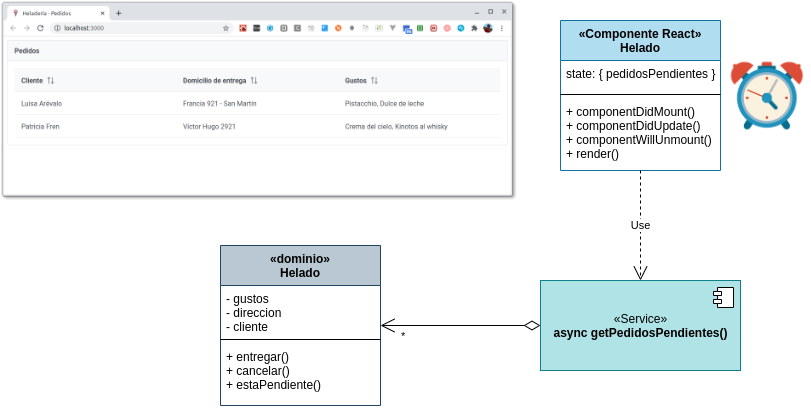
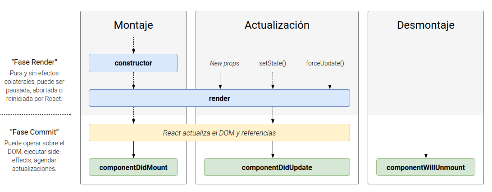

## Ejemplo - Ciclo de vida de un componente React

En este ejemplo podemos ver cómo funcionan los eventos en un componente React modelado como una clase. La aplicación consiste en modelar los pedidos para una heladería:


## Arquitectura general de la aplicación



En esta solución participan

- el objeto de dominio Helado
- una función asincrónica que simula pedidos pendientes
- y el componente React, modelado en este caso como una clase, con estado, que dispara periódicamente la consulta al servicio para obtener los pedidos pendientes

## Dominio

El objeto de dominio que representa un helado almacena información sobre los gustos, dirección, etc., un identificador autogenerado internamente (utiliza una constante encapsulada dentro del archivo), y tiene métodos para

- informar que el pedido fue entregado
- informar que se canceló la entrega del pedido (vuelve a estar pendiente)
- determinar si el pedido está o no pendiente

## Servicio

La función `getPedidosPendientes` exportada es asincrónica, ya que la intención es simular que el origen de datos puede estar fuera de la VM donde se ejecuta la aplicación React. El objetivo que cumple cada vez que es invocada es:

- aleatoriamente marcar/desmarcar pedidos como entregados o pendientes, para forzar un cambio en la lista de pedidos pendientes de la heladería
- devolver la lista con los pedidos pendientes

```js
const cambiarEstadoPedidos = () => {
  pedidos.forEach((pedido) => {
    const random = Math.random() * 10 + 1
    if (random > 5) {
      pedido.entregar()
    } else {
      pedido.cancelar()
    }
  })
}

export const getPedidosPendientes = async () => {
  cambiarEstadoPedidos()
  return pedidos.filter((pedido) => pedido.estaPendiente())
}
```

## Componente React

### Estado

Necesitamos que nuestro componente reaccione ante los cambios en los pedidos pendientes, por eso formará parte de nuestro estado:

```jsx
  constructor(props) {
    super(props)
    this.toast = createRef()
    this.state = {
      pedidosPendientes: [],
    }
  }
```

Además vamos a guardar una referencia al componente Toast, para poder mostrar un mensaje al usuario en caso de actualizar satisfactoriamente o encontrar un error.

### Render

El componente React utiliza el framework PrimeReact para simplificar la creación de la tabla, solo debemos indicar declarativamente cuáles son las columnas que nos interesan:

```jsx
  render() {
    return (
      <Panel header="Pedidos">
        <DataTable value={this.state.pedidosPendientes}>
          <Column field="cliente" header="Cliente" sortable></Column>
          <Column field="direccion" header="Domicilio de entrega" sortable></Column>
          <Column field="gustosPedidos" header="Gustos" sortable></Column>
        </DataTable>
        <Toast ref={this.toast}></Toast>
      </Panel>
    )
  }
```

En el ejemplo, "Domicilio de entrega" es lo que figurará en nuestro Table Header, mientras que el valor de cada fila se llenará con el atributo `direccion` de cada helado.

Fíjense además que la definición del Toast hace referencia a nuestra variable de instancia `toast` del componente React.

### Eventos del componente



### Component did mount

Cuando nuestro componente comience, disparamos cada _x_ segundos la llamada asincrónica que obtiene los pedidos pendientes. 

```js
  componentDidMount() {
    console.log('component did mount')
    this.timerID = setInterval(
      () => this.actualizarPedidosPendientes(),
      10000
    )
  }
```

Esto podemos hacerlo en el constructor, o en el evento `componentDidMount`. Dado que estamos esperando 10 segundos para actualizar el estado, podríamos haber utilizado el constructor sin inconvenientes. No obstante, si necesitamos acceder a elementos del DOM (como al Toast) esto representa un problema si estamos trabajando en el constructor, porque todavía no hay elementos en nuestro HTML, estamos en una fase previa.

Por ese motivo, y para estos casos muy puntuales donde necesitamos manipular el DOM, React provee un evento `componentDidMount` que se ubica temporalmente después de ejecutar el constructor, el render y luego de haber actualizado las referencias y el DOM.

### Actualización del estado

El método actualizarPedidosPendientes hace la llamada asincrónica para recibir los pedidos pendientes, lo que requiere actualizar el estado de la página para forzar el render:

```js
  async actualizarPedidosPendientes() {
    try {
      const pedidosPendientes = await getPedidosPendientes()
      this.setState({
        pedidosPendientes
      })
    } catch (e) {
      this.toast.current.show({ severity: 'error', detail: e.message })
    }
  }
```

Recordemos:

- no debemos cambiar el estado mediante `this.state = ...` sino llamando al método `setState`
- el método es `async`, por eso envolvemos el pedido en un `try/catch` para mostrar el error ante cualquier problema

### Component will unmount

En este evento eliminaremos la ejecución periódica del método que busca los pedidos pendientes:

```js
componentWillUnmount() {
  console.log('component will unmount')
  clearInterval(this.timerID)
}
```

Es poco frecuente ver código asociado a este evento, las excepciones tienen que ver con liberar recursos del sistema.

### Component did update

Un detalle adicional que queremos mostrar es

- cuántos pedidos nuevos hay (los que no estaban anteriormente y ahora aparecen = Nuevos - Viejos, según la teoría de conjuntos)
- cuántos pedidos se entregaron (los que estaban anteriormente y ahora no están = Viejos - Nuevos, según la teoría de conjuntos)

Esto lo podríamos hacer en el mismo service, aunque deberíamos devolver un JSON más complejo, donde estén las cantidades de pedidos nuevos y entregados junto con los pedidos pendientes. Como alternativa, vamos a aprovechar el evento `componentDidUpdate` como método en nuestro componente React, donde recibiremos las props y el estado previo:

```js
  componentDidUpdate(prevProps, prevState) {
    const idPedido = (pedido) => pedido.id
    const idPedidosViejos = prevState.pedidosPendientes.map(idPedido)
    const idPedidosNuevos = this.state.pedidosPendientes.map(idPedido)
    if (idPedidosViejos !== idPedidosNuevos) {
      const cuantosPedidosNuevos = differenceBy(idPedidosNuevos, idPedidosViejos).length
      const cuantosPedidosViejos = differenceBy(idPedidosViejos, idPedidosNuevos).length
      const detail = `Pedidos nuevos: ${cuantosPedidosNuevos}, Pedidos despachados: ${cuantosPedidosViejos}`
      this.toast.current.show({ severity: 'success', detail })
    }
  }
```

Aquí resolvemos la diferencia de conjuntos entre los nuevos y los viejos y viceversa (gracias a la función `differenceBy` de Lodash) y mostramos el toast si hay alguna diferencia.

## Test

Solo tenemos un _smoke test_ del componente, con el nuevo formato de testeo unitario de Enzyme:

```js
test('renders a header with title', () => {
  const { getByText } = render(<App />)
  const pedidosElement = getByText('Pedidos')
  expect(pedidosElement).toBeInTheDocument()
})
```

Dejamos al lector la implementación de casos de prueba adicionales.

## Bibliografía adicional

- [Estado y ciclo de vida de los componentes de React](https://es.reactjs.org/docs/state-and-lifecycle.html)
