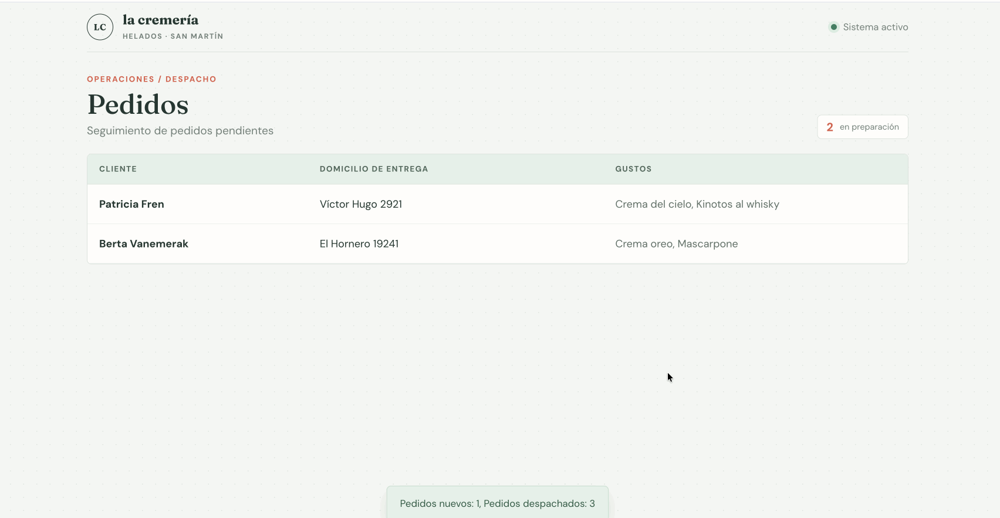
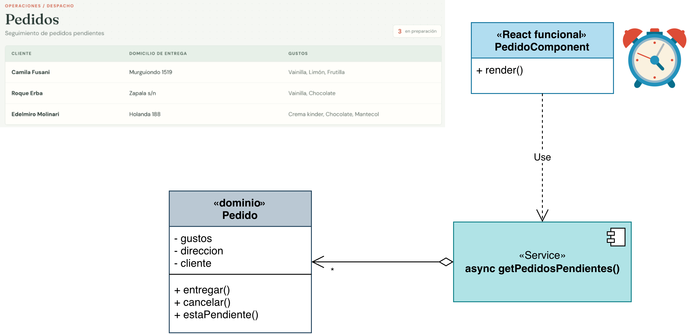
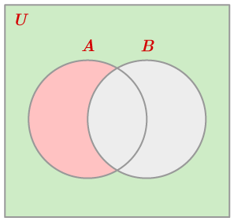

[](https://github.com/uqbar-project/eg-heladeria-react/actions/workflows/build.yml) [](https://codecov.io/gh/uqbar-project/eg-heladeria-react)

## Ejemplo - Ciclo de vida de un componente React

La aplicación consiste en modelar los pedidos para una heladería:



Y en este ejemplo vamos a ver cómo invocar una función asincrónica, y su asociación con el ciclo de vida de los componentes de React.

## Cómo correrlo

Requiere **Node 24** (ver `.nvmrc`) y **pnpm 10** o superior (el proyecto usa pnpm exclusivamente, hay un `preinstall` que lo exige).

```sh
pnpm install
pnpm dev
```

Otros comandos:

| Comando | Qué hace |
| --- | --- |
| `pnpm dev` | Levanta el servidor de desarrollo de Vite |
| `pnpm test` | Corre los tests en modo watch |
| `pnpm run lint` | Chequea el código con Biome |
| `pnpm run lint:fix` | Aplica las correcciones automáticas de Biome |
| `pnpm run build` | Compila para producción |
| `pnpm coverage` | Corre los tests y genera el reporte de coverage |

### Estructura del proyecto

```
src/
├── App.tsx                 # componente raíz: header + <PedidoComponent />
├── main.tsx                # punto de entrada (monta la app)
├── pedido/
│   ├── component.tsx       # el componente React: estado, polling, diff y toast
│   ├── component.css
│   ├── domain.ts           # la clase de dominio Pedido
│   ├── service.ts          # getPedidosPendientes: simula el origen de datos
│   └── *.test.*            # sus tests
└── util/
    ├── sets.ts             # differenceBy e isEmpty
    └── strings.ts          # formatearGusto
```

## Arquitectura general de la aplicación



En esta solución participan

- el objeto de dominio Pedido
- una función asincrónica que simula pedidos pendientes
- y el componente React que a intervalos regulares dispara la consulta

Dado que nuestro componente es una función, no podemos producir efectos colaterales (o "efectos"). De hecho si utilizáramos la variante con clases tampoco podemos hacerlo dentro de la función `render()` porque es cuando se están definiendo los elementos de nuestro DOM. 

## Dominio

El objeto de dominio que representa un pedido (la clase `Pedido`) almacena información sobre los gustos, dirección, etc., un identificador autogenerado internamente (utiliza una constante encapsulada dentro del archivo), y tiene métodos para

- informar que el pedido fue entregado
- informar que se canceló la entrega del pedido (vuelve a estar pendiente)
- determinar si el pedido está o no pendiente

## Servicio

La función `getPedidosPendientes` exportada es asincrónica, ya que la intención es simular que el origen de datos puede estar fuera de la VM donde se ejecuta la aplicación React. El objetivo que cumple cada vez que es invocada es:

- aleatoriamente marcar/desmarcar pedidos como entregados o pendientes, para forzar un cambio en la lista de pedidos pendientes de la heladería
- devolver la lista con los pedidos pendientes

## Componente React

### Estado

- El componente necesita mantener los pedidos actuales como estado
- Para visualizar en un detalle la cantidad de pedidos nuevos y despachados utilizaremos una etiqueta especial (el detalle)
- Y un estado `error` aparte, para que un fallo del origen de datos se muestre como error y no como si fuera un detalle de éxito


```tsx
const [pedidosPendientes, setPedidosPendientes] = useState<Pedido[]>([])
const [detail, setDetail] = useState<string>('')
const [error, setError] = useState<string | null>(null)
```

### Render

El componente React toma los pedidos pendientes y los muestra en una tabla, delegando a otro componente hijo:

```jsx
return (
  <div className="main">
    <h1>Pedidos</h1>
    <div className="pedidos">
      <table>
        <thead>
          <tr>
            <th scope="col">Cliente</th>
            <th scope="col">Domicilio de entrega</th>
            <th scope="col">Gustos</th>
          </tr>
        </thead>
        <tbody>
          {pedidosPendientes.map(pedido => <PedidoRow pedido={pedido} key={pedido.id} />)}
        </tbody>
      </table>
```

Un detalle importante es que cada elemento React debe tener una clave única que lo identifique, para poder asociarlo con el DOM que se visualiza en el navegador.

Además tenemos el toast implementado como un div que se muestra _condicionalmente_ si hay algún mensaje (el error, si lo hubo, tiene prioridad sobre el detalle), y que usa `role="status"` para que un lector de pantalla lo anuncie:

```tsx
const mensaje = error ?? detail
...
{mensaje && <div className={error ? 'toast error' : 'toast'} role="status">{mensaje}</div>}
```

### Disparando la consulta

Dentro del render definimos una lambda que busca los pedidos pendientes cada 5 segundos:

```ts
const intervalRef = useRef<number | null>(null)
...
// Disparar polling automáticamente solo la primera vez
if (!intervalRef.current) {
  intervalRef.current = setInterval(actualizarPedidos, 5000)
  actualizarPedidos()
}
```


> El `setInterval` se crea dentro del render y **no se limpia cuando el componente se desmonta**. Lo dejamos así a propósito: para limpiar un intervalo necesitamos un "teardown" en un componente de función el único hook que ofrece un momento de limpieza es el `cleanup` de un `useEffect` que es la opción que descartamos. En una app comercial, posiblemente construiríamos un hook que haga internamente `useEffect(() => { const id = setInterval(...); return () => clearInterval(id) }, [])` (o usaríamos una biblioteca como SWR). Acá aceptamos esa limitación como parte del objetivo didáctico del ejemplo.

### Mostrando las diferencias

Un detalle adicional que queremos mostrar es

- cuántos pedidos nuevos hay (los que no estaban anteriormente y ahora aparecen = Nuevos - Viejos, según la teoría de conjuntos)
- cuántos pedidos se entregaron (los que estaban anteriormente y ahora no están = Viejos - Nuevos, según la teoría de conjuntos)

Tenemos que obtener la lista actual de pedidos y la vieja, podríamos pensar en implementarlo así

```ts
const actualizarPedidos = async () => {
    try {
      const nuevosPedidosPendientes = await getPedidosPendientes()
      mostrarPedidosActualizados(pedidosPendientes, nuevosPedidosPendientes)
      setPedidosPendientes(nuevosPedidosPendientes)
    } catch (e: unknown) {
      setDetail((e as Error).message)
    }
  }
```

Pero cuando pasamos la función `actualizarPedidos` en setInterval:

```ts
  if (!intervalRef.current) {
    intervalRef.current = window.setInterval(actualizarPedidos, 5000)
    actualizarPedidos()
  }
```

obtiene el valor de `pedidosPendientes` y **no es reactivo**, por lo tanto nos va a aparecer siempre que **todos los pedidos son nuevos**.

Como alternativa tenemos que aprovechar la función setter que nos devuelve el hook useState, ya que el parámetro que recibimos es el valor actual. Entonces generaremos el detalle en ese momento, cuando estamos actualizando los nuevos pedidos pendientes:

```ts
  const actualizarPedidos = async () => {
    try {
      const nuevosPedidosPendientes = await getPedidosPendientes()
      setPedidosPendientes(oldPedidos => {
        mostrarPedidosActualizados(oldPedidos, nuevosPedidosPendientes)
        return nuevosPedidosPendientes
      })
    } catch (e: unknown) {
      setDetail((e as Error).message)
    }
  }
```

> **Esta forma tiene desventajas, y de todas formas la dejamos así.** El updater que le pasamos a `setPedidosPendientes` no es una función pura: dentro suyo llamamos a `setDetail`, que actualiza estado. En teoría React podría invocar el updater más de una vez (por ejemplo en `StrictMode` o en renders reentrantes), y en general no es recomendable disparar estado desde adentro de un updater.
>
> Aun así, es la solución que elegimos, por tres razones:
>
> - Es la forma más natural de expresar lo que queremos: el detalle se calcula a partir de la lista nueva **y** la vieja, en el mismo momento.
> - Hace explícita la dependencia entre `detail` y los pedidos: el detalle se actualiza en el mismo instante en que se actualiza la lista de pedidos.
> - Es más simple. Si quisiéramos evitar esa relación (por ejemplo guardando la lista anterior en un `useRef` y leyendo desde ahí), agregaríamos más código y una relación menos obvia entre el estado y el detalle, lo cual puede confundir a quien está aprendiendo.
>

### Diferencia de conjuntos

```ts
  const mostrarPedidosActualizados = (oldList: Pedido[], newList: Pedido[]) => {
    const idPedido = (pedido: Pedido) => pedido.id
    const nuevos = differenceBy(newList, oldList, idPedido).length
    const despachados = differenceBy(oldList, newList, idPedido).length
    setDetail(`Pedidos nuevos: ${nuevos}, Pedidos despachados: ${despachados}`)
  }
```



Aquí resolvemos la diferencia de conjuntos entre los nuevos y los viejos y viceversa (gracias a la función `differenceBy` que construimos nosotros, podríamos haberla importado de Lodash, pero una decisión que tomamos fue minimizar las dependencias) y mostramos el toast en caso de que haya cambios.

## Test

El test del componente

- genera un stub del service, principalmente con fines didácticos, ya que no estamos realmente consultando a un servicio externo
- el `vi.mock` va en el **nivel superior** del archivo, no adentro de un `beforeEach`: Vitest lo hoist-ea por encima de los imports, así que si lo declaramos dentro de un test o un hook nunca llega a aplicarse
- para testear que no hay pedidos, generamos un div vacío con un testid propio
- para testear que hay pedidos, buscamos cuántos elementos tienen el testid `row` (hay uno por cada pedido)

```js
vi.mock('./service', () => ({
  getPedidosPendientes: () =>
    Promise.resolve([
      new Pedido(['pistacchio', 'dulce de leche'], 'Francia 921 - San Martín', 'Luisa Arévalo'),
      new Pedido(['chocolate', 'crema tramontana', 'crema rusa'], 'Córdoba esq. Crámer', 'El Cholo'),
      new Pedido(['vainilla', 'limón', 'frutilla'], 'Murguiondo 1519', 'Camila Fusani'),
    ]),
}))

test('inicialmente no tenemos pedidos', () => {
  render(<PedidoComponent />)
  const emptyRow = screen.getByTestId('no-rows')
  expect(emptyRow).toBeInTheDocument()
})

test('cuando se actualiza el servidor aparecen nuevos pedidos', async () => {
  render(<PedidoComponent />)
  await waitFor(async () => {
    const allRows = screen.queryAllByTestId('row')
    expect(allRows.length).toBe(3)
  })
})
```

Para testear que el detalle informa correctamente los pedidos **despachados** necesitamos simular una segunda consulta que devuelva menos pedidos que la primera. Para eso el mock tiene que ser una función que podamos ir configurando (`vi.fn()`) y, como el `setInterval` del componente es de 5 segundos, usamos timers falsos para avanzar el tiempo:

```js
vi.useFakeTimers()
// la 1ª consulta devuelve 3 pedidos, la 2ª devuelve sólo el primero.
// Ojo: tienen que ser las MISMAS instancias de Pedido entre ambas
// respuestas, porque el diff compara por id y cada `new Pedido()` genera uno nuevo.
getPedidosPendientesMock
  .mockResolvedValueOnce(lista)
  .mockResolvedValueOnce(lista.slice(0, 1))
```

> Nota: como el diff de conjuntos se calcula por `id` (y el `id` se autogenera con un contador), si cada respuesta del mock creara sus propios `Pedido` nuevos, todos parecerían "nuevos" en cada consulta y el test no probaría nada. Por eso reutilizamos las mismas instancias y sólo cambiamos cuántas se devuelven.

## Material adicional

- [Manejo de estado en React](https://es.react.dev/learn/state-a-components-memory)
- [Documentación de setInterval](https://developer.mozilla.org/en-US/docs/Web/API/Window/setInterval)
- [(Deprecado) Estado y ciclo de vida de los componentes de React](https://es.reactjs.org/docs/state-and-lifecycle.html)
