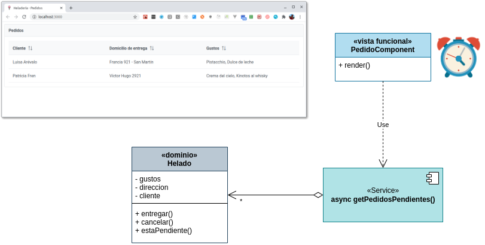

[](https://github.com/uqbar-project/eg-heladeria-react/actions/workflows/build.yml) 

## Ejemplo - Ciclo de vida de un componente React

La aplicación consiste en modelar los pedidos para una heladería:


Y en este ejemplo vamos a conocer el hook [`useEffect`](https://reactjs.org/docs/hooks-effect.html), asociado al ciclo de vida de los componentes de React.

## Arquitectura general de la aplicación



En esta solución participan

- el objeto de dominio Helado
- una función asincrónica que simula pedidos pendientes
- y el componente React

Dado que nuestro componente es una función, no podemos producir efectos colaterales (o "efectos"). De hecho si utilizáramos la variante con clases tampoco podemos hacerlo dentro de la función `render()` porque es cuando se están definiendo los elementos de nuestro DOM. En lugar de eso, **cada cierto tiempo, debemos disparar periódicamente la consulta al servicio para obtener los pedidos pendientes**. Esto lo vamos a resolver mediante el hook `useEffect` que terminará generando un nuevo estado (`setPedidosPendientes`).

## Dominio

El objeto de dominio que representa un helado almacena información sobre los gustos, dirección, etc., un identificador autogenerado internamente (utiliza una constante encapsulada dentro del archivo), y tiene métodos para

- informar que el pedido fue entregado
- informar que se canceló la entrega del pedido (vuelve a estar pendiente)
- determinar si el pedido está o no pendiente

## Servicio

La función `getPedidosPendientes` exportada es asincrónica, ya que la intención es simular que el origen de datos puede estar fuera de la VM donde se ejecuta la aplicación React. El objetivo que cumple cada vez que es invocada es:

- aleatoriamente marcar/desmarcar pedidos como entregados o pendientes, para forzar un cambio en la lista de pedidos pendientes de la heladería
- devolver la lista con los pedidos pendientes

```js
const cambiarEstadoPedidos = () => {
  pedidos.forEach((pedido) => {
    const random = Math.random() * 10 + 1
    if (random > 5) {
      pedido.entregar()
    } else {
      pedido.cancelar()
    }
  })
}

export const getPedidosPendientes = async () => {
  cambiarEstadoPedidos()
  return pedidos.filter((pedido) => pedido.estaPendiente())
}
```

## Componente React

### Estado

- Necesitamos que nuestro componente reaccione ante los cambios en los pedidos pendientes, por eso formará parte de nuestro estado.
- Además vamos a guardar una referencia al componente Toast, para poder mostrar un mensaje al usuario en caso de actualizar satisfactoriamente o encontrar un error. Para ello existe un nuevo hook, [`useRef`](https://es.reactjs.org/docs/hooks-reference.html#useref).

```jsx
const [pedidosPendientes, setPedidosPendientes] = useState([])
const toast = useRef(null)
```

`useRef` es una caja donde podemos almacenar cualquier valor y reasignarlo. El valor actual está en la propiedad `current` del objeto:

```js
toast.current.show({ ... })
```

### Render

El componente React utiliza el framework [PrimeReact](https://www.primefaces.org/primereact/) para simplificar la creación de la tabla, solo debemos indicar declarativamente cuáles son las columnas que nos interesan:

```jsx
return (
  <Panel header="Pedidos">
    <DataTable value={pedidosPendientes}>
      <Column data-testid="fila" field="cliente" header="Cliente" sortable></Column>
      <Column field="direccion" header="Domicilio de entrega" sortable></Column>
      <Column field="gustosPedidos" header="Gustos"></Column>
    </DataTable>
    <Toast ref={toast}></Toast>
  </Panel>
)
```

En el ejemplo, "Domicilio de entrega" es lo que figurará en nuestro Table Header, mientras que el valor de cada fila se llenará con el atributo `direccion` de cada helado.

Fíjense además que la definición del Toast hace referencia a nuestra variable de instancia `toast` del componente React.

### Eventos del componente


### Component did mount / Component did update => hook useEffect

Cuando nuestro componente comience, disparamos cada _x_ segundos la llamada asincrónica que obtiene los pedidos pendientes. Originalmente esto se hacía de esta manera:

```js
  componentDidMount() {
    console.log('component did mount')
    this.timerID = setInterval(
      () => this.actualizarPedidosPendientes(),
      10000
    )
  }
```

El hook `useEffect` nos permite lograr el mismo efecto:

```jsx
useEffect(() => {
  const timerID = setInterval(
    async () => {
      try {
        console.info('Actualizando pedidos pendientes')
        const nuevosPedidosPendientes = await getPedidosPendientes()
        actualizarPedidos(pedidosPendientes, nuevosPedidosPendientes)
        setPedidosPendientes(nuevosPedidosPendientes)
      } catch (e) {
        toast.current.show({ severity: 'error', detail: e.message })
      }
    },
    10000
  )

  // Importante quitar el timer ya que si no se siguen agregando intervalos para disparar los pedidos pendientes
  return () => { clearInterval(timerID) }
})
```

El hook `useEffect` se ejecuta luego del render del componente, y **recibe como parámetro una función que es la que va a producir el efecto colateral**.

### Mostrando las diferencias

Un detalle adicional que queremos mostrar es

- cuántos pedidos nuevos hay (los que no estaban anteriormente y ahora aparecen = Nuevos - Viejos, según la teoría de conjuntos)
- cuántos pedidos se entregaron (los que estaban anteriormente y ahora no están = Viejos - Nuevos, según la teoría de conjuntos)

```js
const actualizarPedidos = (pedidosPendientes, nuevosPedidosPendientes) => {
  const idPedido = (pedido) => pedido.id
  const idPedidosViejos = pedidosPendientes.map(idPedido)
  const idPedidosNuevos = nuevosPedidosPendientes.map(idPedido)
  if (idPedidosViejos !== idPedidosNuevos) {
    const cuantosPedidosNuevos = differenceBy(idPedidosNuevos, idPedidosViejos).length
    const cuantosPedidosDespachados = differenceBy(idPedidosViejos, idPedidosNuevos).length
    const detail = `Pedidos nuevos: ${cuantosPedidosNuevos}, Pedidos despachados: ${cuantosPedidosDespachados}`
    toast.current.show({ severity: 'info', detail, closable: false })
  }
}
```

Aquí resolvemos la diferencia de conjuntos entre los nuevos y los viejos y viceversa (gracias a la función `differenceBy` de Lodash) y mostramos el toast si hay alguna diferencia.

## Test

El test del componente

- genera un stub del service, principalmente con fines didácticos, ya que no estamos realmente consultando a un servicio externo
- por otra parte, trabaja con **fake timers** para simular que pasaron 11 segundos y verificar que efectivamente se ve la lista de pedidos (es importante limpiar esos timers en el método `afterEach`)
- para testear que no hay pedidos, PrimeReact genera un div vacío cuya clase exacta estamos verificando (no es un test que tenga mucha resiliencia pero también lo mostramos con fines didácticos)
- para testear que hay pedidos, estamos utilizando el queryByRole donde `row` hace referencia a un tag `<tr>` (lo interesante es que puede haber más de un tag html que cumpla ese rol)

```js
jest.mock('./service')

beforeEach(() => {
  jest.useFakeTimers()
  getPedidosPendientes.mockResolvedValue([
    new Pedido(['pistacchio', 'dulce de leche'], 'Francia 921 - San Martín', 'Luisa Arévalo'),
    new Pedido(['chocolate', 'crema tramontana', 'crema rusa'], 'Córdoba esq. Crámer', 'El Cholo'),
    new Pedido(['vainilla', 'limón', 'frutilla'], 'Murguiondo 1519', 'Camila Fusani'),
  ])
})

afterEach(() => {
  jest.runOnlyPendingTimers()
  jest.useRealTimers()
})

test('inicialmente no tenemos pedidos', () => {
  render(<PedidoComponent />)
  const emptyRow = screen.getAllByRole('row').find((row) => row.className === 'p-datatable-emptymessage')
  expect(emptyRow).toBeTruthy()
})

test('cuando se actualiza el servidor aparecen nuevos pedidos', async () => {
  render(<PedidoComponent />)
  jest.advanceTimersByTime(11000)
  await waitFor(async () => {
    const allRows = screen.queryAllByRole('row')
    // hay que considerar el encabezado
    // es muy desagradable tener que hacer esto pero el componente DataTable no nos da data-testid
    expect(allRows.length).toBe(4)
  })
  
})
```

## Bibliografía adicional

- [Estado y ciclo de vida de los componentes de React](https://es.reactjs.org/docs/state-and-lifecycle.html)
